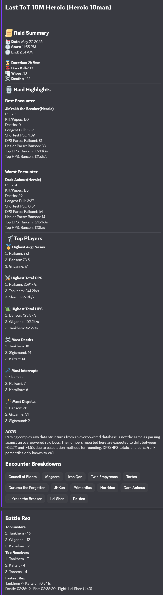
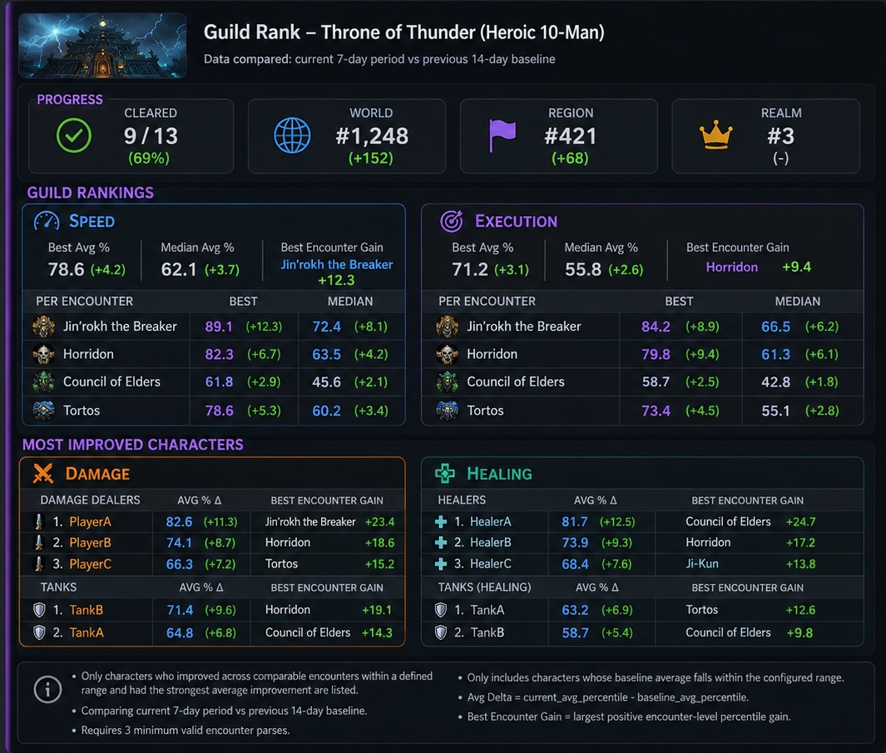

# wclogs.report




Beta Warcraft Logs report-summary service for Discord.

`wclogs.recap` fetches Warcraft Logs reports, normalizes the GraphQL payloads into typed raid report models, and renders concise Discord-ready summaries. The current beta focuses on `/report` for Warcraft Logs Classic raid reports, with Mongo-backed caching and automatic report posting.

## Beta Status

The beta is usable for live report generation, but the internals are still being refined.

Currently working:

- Discord interaction webhook handling with signature verification.
- `/report` flow for Warcraft Logs URLs.
- Report sections for metadata, summary stats, encounter highlights, top players, and source details.
- Report-wide leaderboard for damage, healing, and damage taken parses, plus total deaths, dispels, and interrupts.

Known beta limitations:

- WCL GraphQL payload shapes vary, and so may results.
- Worker processing is intentionally simple and serial.
- The Discord renderer is optimized for concise leaderboards, not granular analysis.
- Error handling is rudimentary at best, requires more debugging than necessary.
- Compare configuration, character-claim, officer, and privacy settings remain in place, but no `/compare` command is currently registered.

## Deployment Notes

Character claim history may exist in beta databases. Web and worker startup run `migrateCharacterClaimIdentityFields()` before serving traffic. The migration backfills missing `claimId`, `normalizedRealm`, and `normalizedCharacterName` values, normalizes stored claim regions, drops the legacy exact-owner claim uniqueness index, and creates the active-claim unique index for `{ guildId, region, normalizedRealm, normalizedCharacterName }`. If duplicate pending or approved claims would violate that index, startup fails and reports the duplicate identity instead of silently choosing a winner.

## Beta Testing

WCLogs Report is currently in beta. The app is being tested in a dedicated Discord server before it is treated as stable for wider use.

Beta testers invited to the server are encouraged to try the current Discord command flow, report confusing behavior, and submit reproducible bugs or feature requests.

### What testers should test

Please focus on the current user-facing Discord flow:

1. Run `/health` to confirm the bot is responding.
2. Run `/report <wcl_report_url>` with a public Warcraft Logs report.
3. Review the private report summary response.
4. Report bugs, confusing output, or missing context.

Compare-adjacent administration testing is limited to the current config, claim, officer, and privacy commands:

- Guild administrators can add explicit officer users with `/add_officer user:<user>`, remove them with `/remove_officer user:<user>`, and review them privately with `/list_officers`.
- `/claim_character` requests officer-approved ownership for an exact character identity.
- `/approve_character` and `/reject_character` are limited to Discord administrators, Manage Server users, and configured officer users.
- `/compare_privacy character:<name> realm:<realm> region:<region> peer_compare:<private|allow_guild> public_post:<deny|allow>` updates privacy for an approved owner claim.

After deploying command changes, re-register Discord commands:

```bash
pnpm --filter @wcl/web register:discord-commands
```

Useful things to check:

- Does the command respond successfully?
- Does the app reject invalid Warcraft Logs URLs clearly?
- Does the report identify the raid, date, and bosses correctly?
- Do player names, classes, and performance highlights look correct?
- Do the labels, rankings, and metrics make sense and are understandable?
- Does automatic report posting behave as expected when enabled?
- Does repeated use of the same report behave consistently?

### Reporting bugs

Please report confirmed bugs through the project issue tracker.

Before opening an issue, check whether the bug is already listed in the beta Discord server or in existing GitHub issues.

A useful bug report should include:

    Title:
    Short description of the problem

    Command used:
    Example: /report <wcl_report_url>

    Warcraft Logs report:
    Paste the public report URL or report code if it can be shared.

    Expected behavior:
    What you expected the app to do.

    Actual behavior:
    What happened instead.

    Steps to reproduce:
    1. ...
    2. ...
    3. ...

    Screenshots:
    Attach screenshots if they help explain the issue.

    Frequency:
    Did this happen once, repeatedly, or every time?

    Environment:
    Discord desktop, Discord mobile, browser, or other relevant context.

Please avoid posting anything that should not be public.

### Requesting features

A useful feature request should explain:

- What problem the feature solves
- Who benefits from it
- What the current workaround is
- What the desired output or command behavior should look like

Example:

    Feature:
    Show the boss name next to the best single-boss parse.

    Problem:
    The report can show the best parse value, but without the boss name it is hard to understand where that performance happened.

    Desired behavior:
    Best Single-Boss Parse: PlayerName - 97.3 on BossName

### Contributing

Contributions are welcome while the project is in beta.

Good first contributions include:

- README improvements
- clearer setup instructions
- test cases
- bug reproduction notes
- Discord embed wording improvements
- parser edge-case fixes
- TypeScript type tightening

Before opening a pull request:

1. Open or comment on an issue describing the change.
2. Keep the change focused.
3. Include screenshots for Discord output changes when possible.
4. Explain how the change was tested.

## Repository Layout

```text
  wclogs.report/
    apps/
      web/            Fastify API, Discord webhook, WCL OAuth routes
      worker/         Discord Gateway and passive auto-report worker
    packages/
      db/             Mongoose models and Mongo stores/services
      discord/        Discord commands, interaction handling, embed rendering
      domain/         Normalized raid types and report section builders
      shared/         Logger, Zod helpers, shared utility types
      wcl-client/     Warcraft Logs GraphQL client, cache policy, parsers
    pnpm-workspace.yaml
```

## Report Output

The beta report summary is rendered as a Discord embed with these sections:

- `Metadata`: report title, raid, difficulty, date, start/end time, and duration.
- `Summary`: boss pulls, kills, wipes, and deaths.
- `Encounter Highlights`: best execution and biggest trouble encounters when enough data is available.
- `Top Players`: top parse, throughput, volume, deaths, interrupts, and dispels.
- `Data Source`: source Warcraft Logs report URL and partial-data notes.

Example source input:

`https://classic.warcraftlogs.com/reports/jLXw9HBGyRW6D8vZ`

## Requirements

- Node.js compatible with the repo toolchain.
- PNPM via Corepack. The repo declares `pnpm@10.33.0`.
- MongoDB connection string.
- Warcraft Logs API client ID and client secret.
- Discord application credentials for the Discord webhook flow.

## Environment

The web app loads `.env` from the repo root when present.

Required for `apps/web`:

| Variable                   | Purpose                                                               |
| -------------------------- | --------------------------------------------------------------------- |
| `MONGODB_URI`              | MongoDB connection URI.                                               |
| `DISCORD_PUBLIC_KEY`       | 64-character Discord public key used to verify interactions.          |
| `DISCORD_APPLICATION_ID`   | Discord application ID.                                               |
| `DISCORD_BOT_TOKEN`        | Discord bot token used for command registration and response edits.   |
| `WCL_CLIENT_ID`            | Warcraft Logs v2 OAuth client ID.                                     |
| `WCL_CLIENT_SECRET`        | Warcraft Logs v2 OAuth client secret.                                 |
| `WCL_TOKEN_ENCRYPTION_KEY` | Base64-encoded 32-byte key for encrypting linked WCL user tokens.     |
| `PUBLIC_APP_BASE_URL`      | Public app origin used to derive OAuth callbacks and public app URLs. |
| `COOKIE_SECRET`            | Secret for signed cookies used by OAuth state and dashboard sessions. |
| `DASHBOARD_ADMIN_SECRET`   | Shared admin secret for dashboard login in production.                |

Optional web variables:

| Variable                     | Default                                      | Purpose                                                                                |
| ---------------------------- | -------------------------------------------- | -------------------------------------------------------------------------------------- |
| `NODE_ENV`                   | `development`                                | Runtime mode: `development`, `test`, or `production`.                                  |
| `PORT`                       | `3000`                                       | HTTP port for the Fastify web service.                                                 |
| `WCL_API_BASE_URL`           | `https://www.warcraftlogs.com/api/v2/client` | WCL GraphQL API endpoint.                                                              |
| `WCL_REDIRECT_URI`           | derived from `PUBLIC_APP_BASE_URL`           | Transitional full callback URL override for WCL user OAuth routes.                     |
| `DISCORD_CLIENT_SECRET`      | unset                                        | Enables Discord OAuth dashboard login when set.                                        |
| `DISCORD_OAUTH_REDIRECT_URI` | derived from `PUBLIC_APP_BASE_URL`           | Transitional full callback URL override for Discord OAuth dashboard login.             |
| `DISCORD_INTERACTIONS_URL`   | derived from `PUBLIC_APP_BASE_URL`           | Transitional full URL override for the Discord interaction webhook endpoint.           |
| `DASHBOARD_AUTH_DISABLED`    | unset                                        | Development/test-only dashboard auth bypass. Only `true` and `false` are valid values. |

Dashboard notes:

- `DASHBOARD_ADMIN_SECRET` authenticates dashboard login requests only.
- `COOKIE_SECRET` signs dashboard session cookies; rotating it invalidates existing dashboard sessions.
- `WCL_TOKEN_ENCRYPTION_KEY` encrypts stored Warcraft Logs user OAuth tokens; rotating it without a migration makes existing linked WCL tokens unreadable.
- `POST /api/dashboard/login` is intentionally exempt from `X-Dashboard-Request: 1`
  because it is the unauthenticated session-establishment endpoint.
- Authenticated dashboard mutations require `X-Dashboard-Request: 1`, including
  logout, guild onboarding, config patching, and officer add/remove routes. This
  remains true when `DASHBOARD_AUTH_DISABLED=true` in development or test.
- Production refuses to start without `DASHBOARD_ADMIN_SECRET`.
- Production refuses to start with `DASHBOARD_AUTH_DISABLED=true`.
- Development requires `DASHBOARD_ADMIN_SECRET` unless `DASHBOARD_AUTH_DISABLED=true`.
- Test does not require `DASHBOARD_ADMIN_SECRET`.
- Do not use `1`, `yes`, `on`, or empty strings for `DASHBOARD_AUTH_DISABLED`; invalid values are rejected.

Required for `apps/worker`:

| Variable                   | Purpose                                                     |
| -------------------------- | ----------------------------------------------------------- |
| `MONGODB_URI`              | MongoDB connection URI.                                     |
| `DISCORD_BOT_TOKEN`        | Discord bot token used for Gateway and Discord API calls.   |
| `WCL_CLIENT_ID`            | Warcraft Logs v2 OAuth client ID.                           |
| `WCL_CLIENT_SECRET`        | Warcraft Logs v2 OAuth client secret.                       |
| `WCL_TOKEN_ENCRYPTION_KEY` | Base64-encoded 32-byte key for linked WCL user token reads. |

Useful WCL client toggles:

| Variable                | Purpose                                                         |
| ----------------------- | --------------------------------------------------------------- |
| `WCL_OAUTH_TOKEN`       | Use an explicit WCL bearer token instead of client credentials. |
| `WCL_BYPASS_CACHE=true` | Force report fetches to bypass cached payloads.                 |
| `WCL_USE_FIXTURES=true` | Use local fixture mode in targeted development paths.           |

Optional future WCL v1 variables:

| Variable             | Purpose                                                                |
| -------------------- | ---------------------------------------------------------------------- |
| `WCL_V1_CLIENT_NAME` | Descriptive Warcraft Logs v1 client name from the WCL client settings. |
| `WCL_V1_CLIENT_KEY`  | Warcraft Logs v1 REST API client key. Keep it server-only.             |

The current report flow uses WCL v2 GraphQL. WCL v1 variables are reserved for
documented v1 REST endpoints such as guild reports, character rankings, and
parses if a future feature needs them.

## Install

```sh
corepack enable
pnpm install
```

Create a root `.env` with the variables above. This repo does not currently ship a committed `.env.example`.

## Local Development

Run the web app:

```sh
pnpm dev:web
```

Run the worker:

```sh
pnpm dev:worker
```

Register Discord commands:

```sh
pnpm --filter @wcl/web register:discord-commands
```

To register commands to a guild, provide `DISCORD_GUILD_ID` in the environment or pass the guild ID as the command argument if using the app script convention.

For a `401 Unauthorized` response, reset/copy the bot token from the Discord Developer Portal **Bot** page and store only the raw token in `DISCORD_BOT_TOKEN`. Do not include the `Bot ` prefix, and do not use the public key, client secret, or application ID in that variable.

## HTTP Routes

| Route                        | Purpose                                                  |
| ---------------------------- | -------------------------------------------------------- |
| `GET /health`                | Basic health check returning `{ "status": "ok" }`.       |
| `POST /api/report`           | Fetch and normalize a report payload from a report code. |
| `POST /discord/interactions` | Discord interaction webhook endpoint.                    |
| `GET /api/auth/wcl/status`   | Inspect stored WCL user OAuth state.                     |
| `GET /api/auth/wcl/login`    | Start WCL user OAuth.                                    |
| `GET /api/auth/wcl/callback` | Complete WCL user OAuth.                                 |

## Verification

Run the same checks used during beta hardening:

```sh
pnpm test
pnpm typecheck
pnpm lint
pnpm -r build
```

Focused package checks are useful while working inside one package:

```sh
pnpm --filter @wcl/wcl-client test
pnpm --filter @wcl/discord test
pnpm --filter @wcl/domain test
```

## Operational Notes

- Discord requires interaction webhooks to acknowledge quickly. The web route defers the response and schedules the heavier WCL report work after the HTTP response finishes.
- Report-wide table data is normalized into report totals and top-player rows.
- Per-encounter boss rankings are fetched with bounded concurrency to reduce report latency without firing every boss request at once.
- Mongo report cache entries include payload versions so stale normalized/raw payload shapes can be refetched after parser changes.
- Logs are emitted through Pino with sensitive fields redacted by `@wcl/shared`.

## License

MIT.
