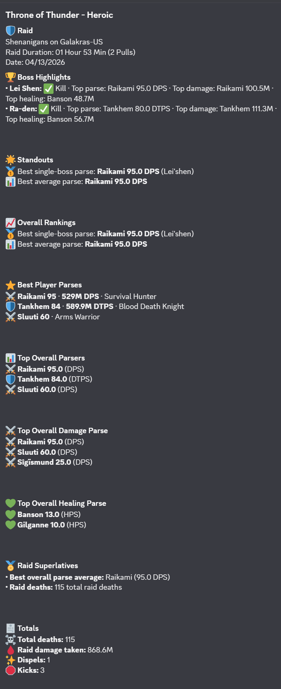

# wclogs.recap



Beta Warcraft Logs recap service for Discord.

`wclogs.recap` fetches Warcraft Logs reports, normalizes the GraphQL payloads into typed raid recap models, and renders concise Discord-ready summaries. The current beta focuses on `/recap` for Warcraft Logs Classic raid reports, with Mongo-backed caching and preview state.

## Beta Status

The beta is usable for live recap generation, but the internals are still being refined.

Currently working:

- Discord interaction webhook handling with signature verification.
- `/recap` flow for Warcraft Logs URLs.
- Recap sections for Outcome, Performance, Volume, Execution, and Report link.
- Report-wide leaderboard for damage, healing, and damage taken parses, plus total deaths, dispels, and interrupts.
- Private `/compare` MVP for exact-character history when stored comparison snapshots and authorization are available.

Known beta limitations:

- WCL GraphQL payload shapes vary, and so may results.
- Worker processing is intentionally simple and serial.
- The Discord renderer is optimized for concise leaderboards, not granular analysis.
- Error handling is rudimentary at best, requires more debugging than necessary.
- `/config compare_mode` is only the guild default comparison policy for commands without an explicit mode. It is not the primary comparison feature.
- `/compare` is private by default and requires exact-character identity plus authorization. Regular raiders cannot freely compare every character in the server.
- Mixed comparisons still require explicit player-character mapping and are not available yet. Alts are not guessed automatically.
- Public compare posting is disabled by default and requires explicit server and target safeguards when enabled.

## Beta Testing

WCLogs Recap is currently in beta. The app is being tested in a dedicated Discord server before it is treated as stable for wider use.

Beta testers invited to the server are encouraged to try the current Discord command flow, report confusing behavior, and submit reproducible bugs or feature requests.

### What testers should test

Please focus on the current user-facing Discord flow:

1. Run `/health` to confirm the bot is responding.
2. Run `/recap <log url>` with a public Warcraft Logs report.
3. Review the private preview response.
4. Use the post/confirm button if the recap looks correct, or cancel if not.
5. Report bugs, confusing output, or missing context.

Comparison testing is limited to the private-first MVP:

- Guild administrators can add explicit officer users with `/add_officer user:<user>`, remove them with `/remove_officer user:<user>`, and review them privately with `/list_officers`.
- `/claim_character` requests officer-approved ownership for an exact character identity.
- `/approve_character` and `/reject_character` are limited to Discord administrators, Manage Server users, and configured officer users.
- `/compare report:<url> character:<name> mode:character` returns a private comparison only when the requester is authorized.
- `/compare ... visibility:public` is explicit and must pass public-post safeguards; it is not the default.
- `/compare ... mode:mixed` currently explains that explicit mapping is required and does not infer alts.

After deploying command changes, re-register Discord commands:

```bash
pnpm --filter @wcl/web register:discord-commands
```

Useful things to check:

- Does the command respond successfully?
- Does the app reject invalid Warcraft Logs URLs clearly?
- Does the recap identify the raid, date, and bosses correctly?
- Do player names, classes, and performance highlights look correct?
- Do the labels, rankings, and metrics make sense and are understandable?
- Does the preview/post flow behave as expected?
- Does repeated use of the same report behave consistently?

### Reporting bugs

Please report confirmed bugs through GitHub Issues:

https://github.com/yay5a/wclogs.recap/issues

Before opening an issue, check whether the bug is already listed in the beta Discord server or in existing GitHub issues.

A useful bug report should include:

    Title:
    Short description of the problem

    Command used:
    Example: /recap <url>

    Warcraft Logs report:
    Paste the public report URL or report code if it can be shared.

    Expected behavior:
    What you expected the app to do.

    Actual behavior:
    What happened instead.

    Steps to reproduce:
    1. ...
    2. ...
    3. ...

    Screenshots:
    Attach screenshots if they help explain the issue.

    Frequency:
    Did this happen once, repeatedly, or every time?

    Environment:
    Discord desktop, Discord mobile, browser, or other relevant context.

Please avoid posting anything that should not be public.

### Requesting features

A useful feature request should explain:

- What problem the feature solves
- Who benefits from it
- What the current workaround is
- What the desired output or command behavior should look like

Example:

    Feature:
    Show the boss name next to the best single-boss parse.

    Problem:
    The recap can show the best parse value, but without the boss name it is hard to understand where that performance happened.

    Desired behavior:
    Best Single-Boss Parse: PlayerName - 97.3 on BossName

### Contributing

Contributions are welcome while the project is in beta.

Good first contributions include:

- README improvements
- clearer setup instructions
- test cases
- bug reproduction notes
- Discord embed wording improvements
- parser edge-case fixes
- TypeScript type tightening

Before opening a pull request:

1. Open or comment on an issue describing the change.
2. Keep the change focused.
3. Include screenshots for Discord output changes when possible.
4. Explain how the change was tested.

### Self-hosting and development

Normal beta testers do not need to run Docker or self-host the app.

Docker is only for local development or self-hosting. The app needs running services such as the web service, worker, and database. Docker Compose is one way to run those services together.

If you are only testing the hosted beta bot in Discord, use the bot commands in the beta server and report issues through GitHub.

## Repository Layout

```text
  wclogs.recap/
    apps/
      web/            Fastify API, Discord webhook, WCL OAuth routes
      worker/         Mongo-backed background job worker
    packages/
      contracts/      Shared contract package placeholder
      db/             Mongoose models and Mongo stores/services
      discord/        Discord commands, interaction handling, embed rendering
      domain/         Normalized raid types and recap section builders
      shared/         Logger, Zod helpers, shared utility types
      wcl-client/     Warcraft Logs GraphQL client, cache policy, parsers
    docker-compose.yml
    pnpm-workspace.yaml
```

## Recap Output

The beta recap is rendered as a Discord embed with these sections:

- `Outcome`: raid title, guild/realm, duration, date, and boss highlights.
- `Performance`: best parses, best average, best single-boss parse, and overall DPS/HPS/DTPS rankings.
- `Volume`: top damage done, healing done, damage taken, and raid totals.
- `Execution`: top interrupts, top dispels, and raid superlatives.
- `Report`: source Warcraft Logs report URL.

Example source input:

`https://classic.warcraftlogs.com/reports/jLXw9HBGyRW6D8vZ`

## Requirements

- Node.js compatible with the repo toolchain.
- PNPM via Corepack. The repo declares `pnpm@10.33.0`.
- MongoDB connection string.
- Warcraft Logs API client ID and client secret.
- Discord application credentials for the Discord webhook flow.

## Environment

The web app loads `.env` from the repo root when present. Docker Compose also reads root `.env` for variable substitution.

Required for `apps/web`:

| Variable                 | Purpose                                                             |
| ------------------------ | ------------------------------------------------------------------- |
| `MONGODB_URI`            | MongoDB connection URI.                                             |
| `DISCORD_PUBLIC_KEY`     | 64-character Discord public key used to verify interactions.        |
| `DISCORD_APPLICATION_ID` | Discord application ID.                                             |
| `DISCORD_BOT_TOKEN`      | Discord bot token used for command registration and response edits. |
| `WCL_CLIENT_ID`          | Warcraft Logs OAuth client ID.                                      |
| `WCL_CLIENT_SECRET`      | Warcraft Logs OAuth client secret.                                  |
| `WCL_REDIRECT_URI`       | Callback URL for WCL user OAuth routes.                             |
| `COOKIE_SECRET`          | Secret for signed cookies used by OAuth state and dashboard sessions. |
| `DASHBOARD_ADMIN_SECRET` | Shared admin secret for dashboard login in production.               |

Optional web variables:

| Variable                    | Default                                      | Purpose                                               |
| --------------------------- | -------------------------------------------- | ----------------------------------------------------- |
| `NODE_ENV`                  | `development`                                | Runtime mode: `development`, `test`, or `production`. |
| `PORT`                      | `3000`                                       | HTTP port for the Fastify web service.                |
| `WCL_API_BASE_URL`          | `https://www.warcraftlogs.com/api/v2/client` | WCL GraphQL API endpoint.                             |
| `PREVIEW_STATE_TTL_SECONDS` | `900`                                        | TTL for Discord recap preview state.                  |
| `DASHBOARD_AUTH_DISABLED`   | unset                                        | Development/test-only dashboard auth bypass. Only `true` and `false` are valid values. |

Dashboard notes:

- `DASHBOARD_ADMIN_SECRET` authenticates dashboard login requests only.
- `COOKIE_SECRET` signs dashboard session cookies; rotating it invalidates existing dashboard sessions.
- `POST /api/dashboard/login` is intentionally exempt from `X-Dashboard-Request: 1`
  because it is the unauthenticated session-establishment endpoint.
- Authenticated dashboard mutations require `X-Dashboard-Request: 1`, including
  logout, guild onboarding, config patching, and officer add/remove routes. This
  remains true when `DASHBOARD_AUTH_DISABLED=true` in development or test.
- Production refuses to start without `DASHBOARD_ADMIN_SECRET`.
- Production refuses to start with `DASHBOARD_AUTH_DISABLED=true`.
- Development requires `DASHBOARD_ADMIN_SECRET` unless `DASHBOARD_AUTH_DISABLED=true`.
- Test does not require `DASHBOARD_ADMIN_SECRET`.
- Do not use `1`, `yes`, `on`, or empty strings for `DASHBOARD_AUTH_DISABLED`; invalid values are rejected.

Required for `apps/worker`:

| Variable      | Purpose                 |
| ------------- | ----------------------- |
| `MONGODB_URI` | MongoDB connection URI. |

Useful WCL client toggles:

| Variable                | Purpose                                                         |
| ----------------------- | --------------------------------------------------------------- |
| `WCL_OAUTH_TOKEN`       | Use an explicit WCL bearer token instead of client credentials. |
| `WCL_BYPASS_CACHE=true` | Force report fetches to bypass cached payloads.                 |
| `WCL_USE_FIXTURES=true` | Use local fixture mode in targeted development paths.           |

## Install

```sh
corepack enable
pnpm install
```

Create a root `.env` with the variables above. This repo does not currently ship a committed `.env.example`.

## Local Development

Run the web app:

```sh
pnpm dev:web
```

Run the worker:

```sh
pnpm dev:worker
```

Register Discord commands:

```sh
pnpm --filter @wcl/web register:discord-commands
```

To register commands to a guild, provide `DISCORD_GUILD_ID` in the environment or pass the guild ID as the command argument if using the app script convention.

For a `401 Unauthorized` response, reset/copy the bot token from the Discord Developer Portal **Bot** page and store only the raw token in `DISCORD_BOT_TOKEN`. Do not include the `Bot ` prefix, and do not use the public key, client secret, or application ID in that variable.

## Docker

Build and start the beta stack:

```sh
docker compose up --build
```

When using environment loaded by another tool such as `direnv`, run Compose through that tool:

```sh
direnv exec . docker compose up --build
```

The Compose file defines:

- `web`: Fastify API and Discord interactions service on port `3000`.
- `worker`: background Mongo job worker.
- `backend`: internal Docker network.

The checked-in Compose file includes deployment-specific public URLs. Adjust `WCL_REDIRECT_URI`, `DISCORD_INTERACTIONS_URL`, and `PUBLIC_URL` for the target beta environment before deploying elsewhere.

## HTTP Routes

| Route                        | Purpose                                                        |
| ---------------------------- | -------------------------------------------------------------- |
| `GET /health`                | Basic health check returning `{ "status": "ok" }`.             |
| `POST /api/recap`            | Fetch and normalize a recap payload from a report code or URL. |
| `POST /discord/interactions` | Discord interaction webhook endpoint.                          |
| `GET /api/auth/wcl/status`   | Inspect stored WCL user OAuth state.                           |
| `GET /api/auth/wcl/login`    | Start WCL user OAuth.                                          |
| `GET /api/auth/wcl/callback` | Complete WCL user OAuth.                                       |

## Verification

Run the same checks used during beta hardening:

```sh
pnpm test
pnpm typecheck
pnpm lint
pnpm -r build
```

Focused package checks are useful while working inside one package:

```sh
pnpm --filter @wcl/wcl-client test
pnpm --filter @wcl/discord test
pnpm --filter @wcl/domain test
```

## Operational Notes

- Discord requires interaction webhooks to acknowledge quickly. The web route defers the response and schedules the heavier WCL recap work after the HTTP response finishes.
- Report-wide table data is fetched from kill fight IDs and normalized into recap totals and top-player rows.
- Per-encounter boss rankings are fetched with bounded concurrency to reduce report latency without firing every boss request at once.
- Mongo report cache entries include payload versions so stale normalized/raw payload shapes can be refetched after parser changes.
- Logs are emitted through Pino with sensitive fields redacted by `@wcl/shared`.

## License

MIT.
